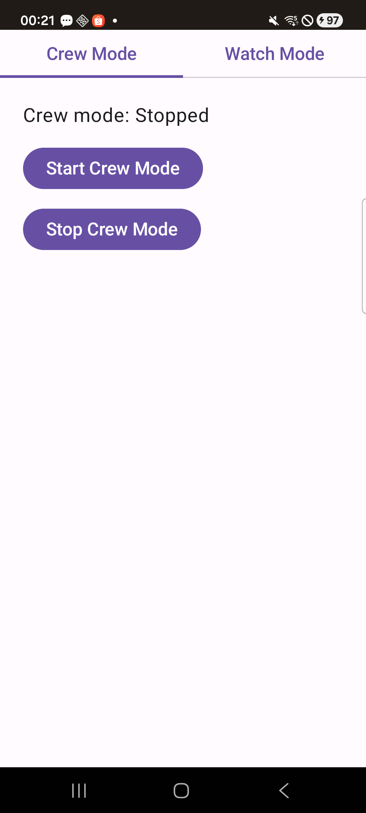
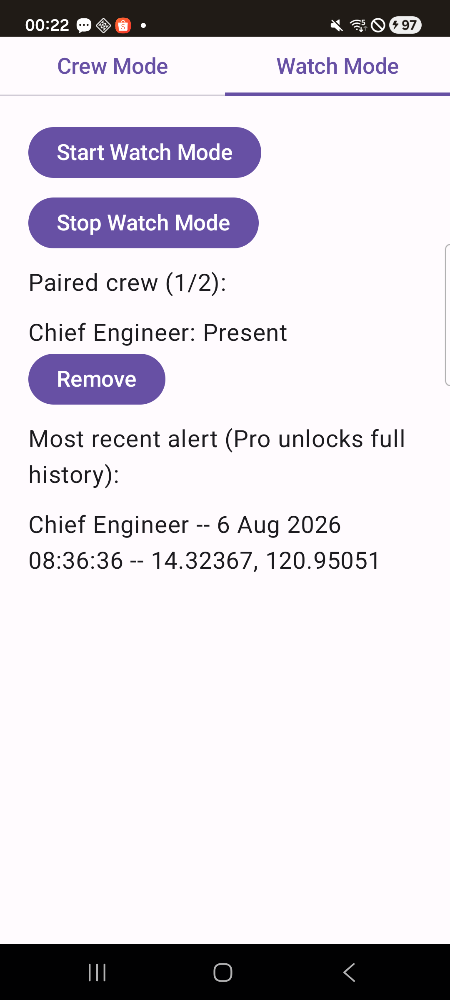

# PocketMOBAlert Lite

A phone-to-phone man-overboard alert for small crews. No dedicated hardware tag, no internet --
just two phones (or more) on the same boat watching each other's backs over Bluetooth Low Energy.

**Crew mode** quietly advertises a BLE beacon in the background. **Watch mode** scans for paired
Crew beacons and sounds a loud alarm the instant one goes out of range or disconnects
unexpectedly. Every phone can run both modes at once, so a small crew can protect each other
mutually -- there's no requirement that one specific "captain's phone" is the only one watching.

**This is the free, zero-hardware default, best suited to smaller crews and day trips -- not a
substitute for certified AIS personal locator beacons.** A phone is bulkier and generally less
water-resistant than a dedicated tag, and it only works if the crew member is actually carrying
it. Commercial PLBs run $250-600 per person; the point of this app is that the marginal cost of
protecting one more crew member is zero, since everyone already owns a phone.

**Zero internet dependency for the alarm, full stop.** Detection and alerting run entirely over
local Bluetooth -- Lite's own manifest doesn't even request the `INTERNET` permission. The deck of
a boat underway typically has no signal; that's completely irrelevant to whether this app works.

Developed by [Trozovka](https://github.com/Trozovka).

## Screenshots

| Crew Mode | Watch Mode |
|---|---|
|  |  |

## Features

- **Crew mode**: BLE peripheral advertising with the screen off, a stable per-install identifier,
  survives Doze once you grant the battery-optimization exemption -- verified running 65+ seconds
  screen-off on real hardware
- **Watch mode**: continuous BLE scanning, a simple "bring the phone close and name it" pairing
  flow, and a two-phase separation check (roughly 8 seconds worst case) that tells a real
  man-overboard event apart from routine BLE dropout (walking below deck, a body blocking
  line-of-sight) without ever delaying a real emergency
- Sounds and vibrates at max volume on the alarm stream (bypasses silent/DND) -- and relays the
  alert to every other paired Watch device on the boat, not just the one phone that noticed first
- Captures GPS position and timestamp the moment an alarm fires, kept in a local alert log --
  Free shows the most recent alert; unlimited history is a Pro feature
- Paired devices are named by you at pairing time ("Chief Engineer", "Skipper", whoever) -- this
  app is for a specific small number of people watching each other's backs, not an anonymous
  numbered roster
- Free tier: full core alarm loop, unlimited time, forever, capped at 2 paired crew devices per
  voyage -- see [Licensing](#licensing) below

## Quick install (no building required)

Download the APK from Gumroad and sideload it: **[trozovka.gumroad.com/l/pocket-mob-alert-lite](https://trozovka.gumroad.com/l/pocket-mob-alert-lite)** ($0)

Since this isn't distributed through Google Play, Android will ask you to allow installing from
this source the first time -- that's expected.

## Build from source

Requires JDK 17 and the Android SDK (the Gradle wrapper handles the rest).

```
git clone --recurse-submodules https://github.com/Trozovka/pocketmobalert-lite.git
cd pocketmobalert-lite
echo "sdk.dir=/path/to/your/android-sdk" > local.properties
./gradlew assembleDebug
adb install app/build/outputs/apk/debug/app-debug.apk
```

## For real mutual protection, run both modes on both phones

Crew mode and Watch mode are independent and can run together on the same phone. For two (or
more) people to protect each other symmetrically, **every phone should run both modes at once**:
each phone broadcasts its own Crew beacon *and* watches for everyone else's. An asymmetric setup
(one phone Crew-only, another Watch-only) only protects the Crew-mode person -- the Watch-only
phone has no beacon of its own for anyone else to watch for.

## Licensing

Free forever, no account needed. The core alarm loop -- Crew beacon, Watch scanning, sound/
vibrate/relay -- never expires and is never gated. The only limits: 2 paired crew devices, and
alert-log history narrowed to the most recent entry. [PocketMOBAlert Pro](#pro-version) removes
both, plus adds the optional OpenCPN chart integration.

## Tech stack

- Kotlin + Jetpack Compose, MVVM
- Gradle multi-module: `:core` (BLE beacon/scan services, pairing, alarm behavior, SQLite alert
  log via Room, entitlement logic, all Compose UI -- shared with the Pro tier) + `:app` (thin Free
  launcher)
- The foreground-service/wake-lock/battery-exemption pattern is pulled in from
  [trozovka-android-toolkit](https://github.com/Trozovka/trozovka-android-toolkit) as a git
  submodule, shared with this developer's other offline-first Android apps rather than duplicated
- minSdk 26, target latest stable Android API
- No existing open-source project matched this app's core concept (phone-to-phone BLE beacon +
  watch/alarm for MOB safety) closely enough to fork or build on -- searched GitHub first; the
  closest results were generic BLE beacon/proximity libraries, none maritime and none doing
  multi-device alarm broadcast, so this was built from scratch

## Pro version

A Pro version with unlimited paired crew, full alert history, and an optional OpenCPN
`$WPL` waypoint integration (one-time purchase) is available separately:
**[trozovka.gumroad.com/l/pocket-mob-alert-pro](https://trozovka.gumroad.com/l/pocket-mob-alert-pro)**.
The Pro app's source is private; this Free repo has the full free-tier source, openly available
under the MIT license below.

## License

MIT -- see [LICENSE](LICENSE) for the full text.

Copyright (c) 2026 Trozovka. Original Author: Trozovka. All derivative works must retain the
[NOTICE](NOTICE) file's attribution. Not a fork of, or derived from, any other project's source.
